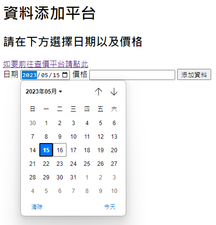
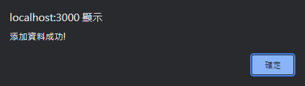
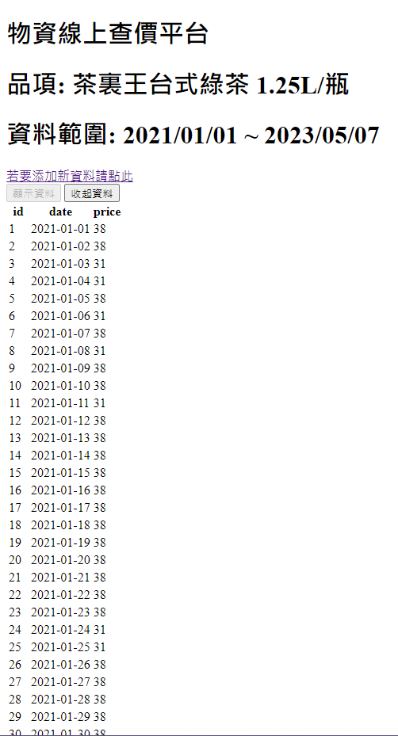

# 作業4 通貨膨脹-你關心缺蛋嗎?

`
姓名: 張牧翔
學號: D1035899
`

- 目標商品來源: [https://price.nat.gov.tw/p/zh_tw/price_history/abf3a12e-93d8-45a1-80cf-d848118a6503](https://price.nat.gov.tw/p/zh_tw/price_history/abf3a12e-93d8-45a1-80cf-d848118a6503)
- 前端網站: [https://d1035899.github.io/HW4/html/table.html](https://d1035899.github.io/HW4/html/table.html)
- 後端網站: [https://d1035899.github.io/HW4/html/data.html](https://d1035899.github.io/HW4/html/data.html)
- 說明網站: [https://github.com/D1035899/HW4/blob/master/README.md](https://github.com/D1035899/HW4/blob/master/README.md)
- Code Repo: [https://github.com/D1035899/HW4](https://github.com/D1035899/HW4)

---

## 目錄

- [作業4 通貨膨脹-你關心缺蛋嗎?](#作業4-通貨膨脹-你關心缺蛋嗎)
  - [目錄](#目錄)
  - [目標商品介紹](#目標商品介紹)
  - [網頁展示](#網頁展示)
    - [添加資料頁面](#添加資料頁面)
    - [顯示資料頁面](#顯示資料頁面)
    - [建立資料庫](#建立資料庫)
  - [心得](#心得)

---

## 目標商品介紹

該商品為茶裏王所推出的台式綠茶口味，由於本人蠻喜歡喝的，再加上有的時候會好奇其價格，因此選擇該商品來調查。

---

## 網頁展示

### 添加資料頁面


>透過html內建的Date picker來選擇日期，並輸入價格；輸入完後，按下Submit就會將新資料添加至資料庫中

``` html
<label for="date">Date</label>
    <input type="date" id="date" name="date"
           value="2023-05-15"
           min="2020-01-01" max="2023-12-31"/>
```

>圖片內的Date picker code, 透過value來設定預設顯示日期, min 和 max分別設定可選擇日期的上下限


>利用alert box的特性，在點擊添加資料後，提醒使用者以添加資料

### 顯示資料頁面


>透過按下顯示資料按鈕就會show出該商品的所有歷史資料，且按下收起資料就會將資料收起來

- 這兩個頁面都有超連結，方便使用者快速查資料以及新增資料

### 建立資料庫

``` javascript
sql = 'CREATE TABLE IF NOT EXISTS price_data (ID INTEGER PRIMARY KEY AUTOINCREMENT, date DATE, price TEXT)'
```

>透過這段code建立資料庫，並指定該資料表有ID、日期、價格，其中日期為DATA型態，該型態的資料與html的 date picker型態一樣，故不用format。

---

## 心得

透過這次的作業讓我稍微了解到前後端是如何運作的，但我覺得我還沒有辦法將express的功能自由運用，因此沒辦法做出自己想做的功能，希望日後可以多加練習，把想要寫的功能學會。
